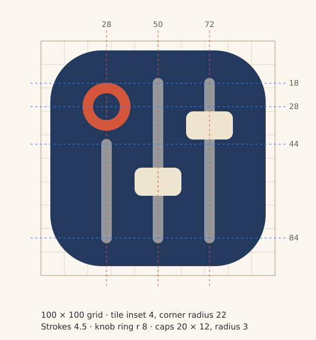
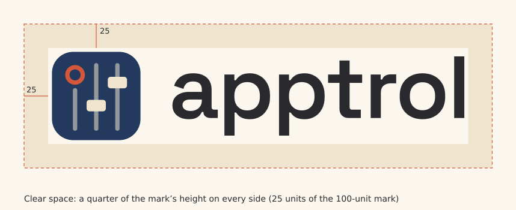

# Apptrol — Brand guide

How to use the Apptrol logo, colours and type. All files are in
[`docs/assets/brand/`](assets/brand/). The reasoning behind the design is in
[ADR 0014](adr/0014-logo-and-visual-identity.md).

<p align="center">
  
</p>

## 1. The idea

The mark is **one channel of a hardware controller, simplified**: a knob and two faders on
a rounded tile. The knob ring is the one warm accent; the faders sit at different heights,
as if two apps were mixed differently. It says *hands-on volume control* without depicting
any specific product.

The colours follow the approach of Sanzō Wada's *A Dictionary of Color Combinations*:
muted, pigment-like tones in a small set — one deep, one light, one accent — that contrast
without clashing, on a warm off-white instead of pure white. They are Apptrol's own
combination in that spirit, not a combination copied from the book.

## 2. Files

| File | Use it for |
|---|---|
| [`apptrol-logo.svg`](assets/brand/apptrol-logo.svg) | **Primary logo** (mark + wordmark) on light backgrounds |
| [`apptrol-logo-dark.svg`](assets/brand/apptrol-logo-dark.svg) | Primary logo on dark backgrounds (cream wordmark) |
| [`apptrol-mark.svg`](assets/brand/apptrol-mark.svg) | The mark alone: app icon, avatar, favicon — any background |
| [`apptrol-mark-16.svg`](assets/brand/apptrol-mark-16.svg) | Pixel-aligned mark for **16 px only** (tray, favicon) |
| [`apptrol-glyph.svg`](assets/brand/apptrol-glyph.svg) | Mark without the tile, for placing directly on **Indigo** |
| [`apptrol-mark-mono-dark.svg`](assets/brand/apptrol-mark-mono-dark.svg) | One colour (Ink), for print, engraving, stamps |
| [`apptrol-mark-mono-light.svg`](assets/brand/apptrol-mark-mono-light.svg) | One colour (Paper), for dark or photographic backgrounds |
| [`apptrol-wordmark.svg`](assets/brand/apptrol-wordmark.svg) / [`-dark`](assets/brand/apptrol-wordmark-dark.svg) | Wordmark alone, when the mark is already shown nearby |
| [`png/apptrol-{16…512}.png`](assets/brand/png/) | Raster mark: 16, 24, 32, 48, 64, 128, 256, 512 px (transparent corners) |
| [`png/apptrol-social-preview.png`](assets/brand/png/apptrol-social-preview.png) | GitHub social preview, 1280 × 640 |

All SVGs are self-contained: no external fonts (the wordmark is outlined), no scripts.

## 3. Construction

<p align="center"></p>

Drawn on a **100 × 100 unit** grid:

| Element | Geometry |
|---|---|
| Tile | Inset 4 on all sides (92 × 92), corner radius 22 |
| Columns | Centres at x = 28, 50, 72 |
| Knob ring | Centre (28, 28), radius 8, stroke 4.5 |
| Rails | Stroke 4.5, round ends; first column 44 → 84, others 18 → 84 |
| Caps | 20 × 12, radius 3; middle column at y 54, right column at y 30 |

The fader positions are part of the logo. Do not move them.

### Small sizes

Below 20 px the regular mark blurs. At **16 px** use `apptrol-mark-16.svg` (or
`png/apptrol-16.png`): the same design redrawn on a 16 × 16 pixel grid with 1 px rails, a
3 × 3 knob ring and 3 × 3 caps, so every edge lands on a whole pixel. From 20 px up, use the
regular mark.

## 4. Colour

| Swatch | Name | Hex | RGB | Role |
|---|---|---|---|---|
|  | **Indigo** | `#233A5E` | 35, 58, 94 | Tile, brand background |
|  | **Cream** | `#EFE4CE` | 239, 228, 206 | Fader caps, wordmark on dark |
|  | **Vermilion** | `#D4573B` | 212, 87, 59 | Knob ring — the single accent |
|  | **Rail** | `#93989C` | 147, 152, 156 | Fader rails (Cream at 55 % over Indigo) |
|  | **Ink** | `#2A2A2E` | 42, 42, 46 | Wordmark and text on light |
|  | **Paper** | `#FBF7EF` | 251, 247, 239 | Light background |
|  | **Sand** | `#F1E7D3` | 241, 231, 211 | Secondary light background |

Use Vermilion sparingly: one accent per view, as in the mark.

### Contrast (WCAG 2)

| Foreground on background | Ratio | OK for |
|---|---|---|
| Ink on Paper | 13.4 : 1 | All text |
| Cream on Indigo | 9.1 : 1 | All text |
| Indigo on Paper | 10.7 : 1 | All text |
| Cream on Ink | 11.3 : 1 | All text |
| Vermilion on Paper | 3.8 : 1 | Large text (24 px+, or 19 px bold) and graphics only |
| Rail on Indigo | 3.9 : 1 | Graphics only |
| Vermilion on Indigo | 2.8 : 1 | **The logo only** — never text or essential UI |

## 5. Typography

- **Typeface:** [Space Grotesk](https://github.com/floriankarsten/space-grotesk) (SIL Open Font License).
- **Wordmark:** SemiBold (600), tracking −2 %, always lowercase: **apptrol**. Use the
  supplied SVG rather than typing it.
- **In running text** the name is written **Apptrol** (capital A), in the surrounding font.
- For headings in project graphics use Space Grotesk 500–700; for body text the reader's
  system font is fine.

## 6. Clear space and minimum size

<p align="center"></p>

- **Clear space:** a quarter of the mark's height on every side. Nothing else — text,
  edges, other logos — enters that area.
- **Minimum size:** mark 16 px (with the 16 px version); full logo 24 px high on screen,
  8 mm high in print. Below that, use the mark alone.

## 7. Backgrounds

| Background | Use |
|---|---|
| Paper, Sand, white, light UI | `apptrol-logo.svg`, `apptrol-mark.svg` |
| Ink, black, dark UI | `apptrol-logo-dark.svg`, `apptrol-mark.svg` |
| Indigo | `apptrol-glyph.svg` + `apptrol-wordmark-dark.svg` (tile would disappear) |
| Photos, busy or mid-tone colours | `apptrol-mark-mono-light.svg` or `-mono-dark.svg`, whichever contrasts more |

## 8. Don't

- Don't recolour the mark, swap the accent, or add gradients, shadows or outlines.
- Don't move, add or remove faders or knobs, or change the tile's radius.
- Don't stretch, skew or rotate the logo.
- Don't retype the wordmark in another font or with a capital A.
- Don't put the full-colour mark on Vermilion or on busy images.
- Don't combine the logo with KORG's name, logo or product styling. Apptrol is not
  affiliated with KORG.

## 9. Making other sizes

The PNGs are rendered from the SVGs. Any SVG renderer produces other sizes, for example:

```bash
rsvg-convert -w 1024 -h 1024 docs/assets/brand/apptrol-mark.svg -o apptrol-1024.png   # librsvg2-bin
inkscape docs/assets/brand/apptrol-mark.svg -w 1024 -o apptrol-1024.png
```

Always render 16 px from `apptrol-mark-16.svg`.

## 10. Licence

The logo and these files are part of Apptrol and covered by its [MIT license](../LICENSE).
The wordmark is Space Grotesk converted to outlines; the font itself is not included and is
licensed separately under the SIL Open Font License.
