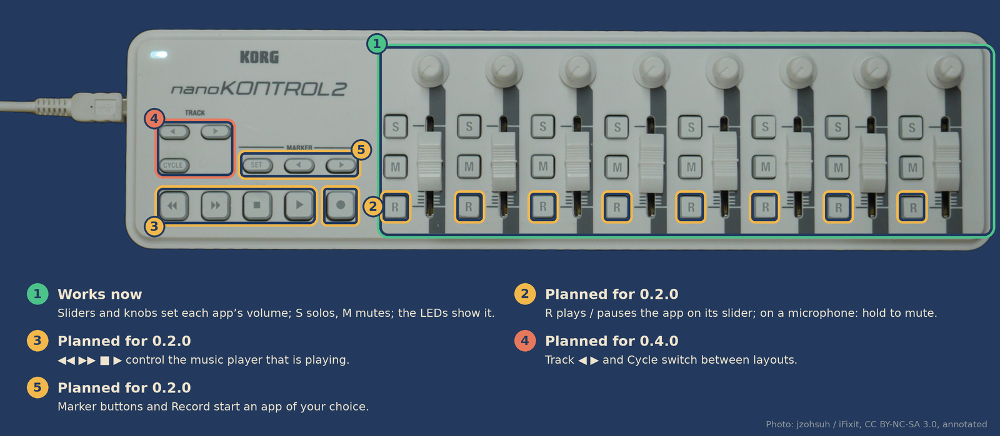

# Apptrol — Roadmap

Each phase ends with a tagged release. Detailed requirements live in
[requirements.md](requirements.md); decisions and their reasons in [adr/](adr/).

| Phase | Goal | Version | Status |
|---|---|---|---|
| 0 | Project setup | 0.0.1 | ✅ Done |
| 1 | Core mixer: sliders, knobs, M, S | 0.1.0 | ✅ Released 2026-09-30 |
| 1.5 | Media buttons and on-screen display | 0.2.0 | ⚪ Planned |
| 2 | Layouts | 0.3.0 | ⚪ Planned |
| 3 | GUI and tray | 0.4.0 | ⚪ Planned |
| – | Backlog | – | ⚪ Unscheduled |

`1.0.0` is released once Phases 1–3 are stable and the config format is frozen.

  

---

## Phase 0 — Project setup

- [x] Requirements, roadmap, configuration reference, decision records
- [x] License (MIT), README, changelog, contributing guide
- [x] Git repository on GitHub (public since the first release, v0.1.0)
- [x] Go module and project skeleton (`cmd/apptrol`, `internal/…`)
- [x] Testing strategy and QA requirements ([ADR 0012](adr/0012-testing-strategy.md), [testing.md](testing.md))
- [x] CI with GitHub Actions: lint, tests (race, coverage gate, two Go versions), `govulncheck`, build
- [x] Release pipeline with GoReleaser on version tags: binaries (x86_64, arm64), .deb, .rpm, checksums ([ADR 0013](adr/0013-release-packaging.md), [releasing.md](releasing.md)); first test release `v0.0.1`
- [x] Dependabot for Go modules and GitHub Actions
- [x] Issue templates (bug report, feature request), pull request template, security policy
- [x] Logo and brand guide: SVG mark and wordmark, PNG sizes, social preview ([brand.md](brand.md), [ADR 0014](adr/0014-logo-and-visual-identity.md))

## Phase 1 — Core mixer (`0.1.0`)

Requirement areas: HW, CTRL, PRIO, MUTE, SOLO, LED, BTN, STATE, CFG, LOG, SVC, NFR, QA.
Design: [architecture.md](architecture.md), [ADR 0015](adr/0015-service-architecture.md).

- [x] Architecture and controller access decided

- [x] Read MIDI from the controller; handle plug / unplug
- [x] Connect to PipeWire (pulse protocol); track playback streams and capture devices; reconnect
- [x] Match streams and inputs against configured apps
- [x] Sliders and knobs set volume; new streams get the control's position
- [x] M (mute) and S (solo) with the agreed semantics
- [x] LED feedback, including the input-column style
- [x] State saving and restore
- [x] TOML config with layout structure, validation, automatic reload
- [x] `apptrol list`, `apptrol check`, `apptrol test`, `apptrol --version`
- [x] `max_volume` per app, up to 150 % (CTRL-03); warning for overlapping match lists (CFG-12)
- [x] Logging to journald and/or a rotating file
- [x] systemd user unit; packaged in .deb / .rpm
- [x] Interfaces and fakes for the controller and audio server (QA-06)
- [x] Tests for matching, mute/solo logic, config validation and state handling, named after requirement IDs (QA-07)
- [x] Fuzz tests for config parsing and MIDI decoding, run briefly in CI (QA-08)
- [x] Integration tests against headless PipeWire in CI (QA-09)
- [x] Raise the coverage minimum as code grows (QA-04): 75 %
- [x] Manual hardware checklist completed ([testing.md](testing.md), QA-12): release candidates rc1 to rc3

**Done when:** all Phase 1 MUST requirements are met, and the hardware checklist passes on
an installed release candidate. (The original goal of a week as the only volume control
was dropped: three release candidates were tested on hardware and daily use showed no
problems. Anything found later ships as a patch release, `0.1.x`.)

## Phase 1.5 — Media buttons and on-screen display (`0.2.0`)

- [ ] ◀◀ ▶▶ ■ ▶ via MPRIS; most recent player by default, optionally pinned
- [ ] On-screen feedback: KDE volume OSD, notification fallback for other desktops
- [ ] Config switch to turn on-screen feedback off

## Phase 2 — Layouts (`0.3.0`)

- [ ] Multiple layouts with their own assignments and saved state
- [ ] Switch behaviour per layout: fixed value (with per-control overrides), last values, carry over
- [ ] Pick-up after a switch; blinking M LED while a control is waiting
- [ ] Track ◀ / ▶ to step through layouts; Cycle + S / M / R to jump to one (up to 24)
- [ ] Optional automatic switching by running application
- [ ] Resolve open question Q-1

## Phase 3 — GUI and tray (`0.4.0`)

- [ ] Record how the GUI talks to the service: D-Bus, decided (Q-4); ADR with Phase 1.5
- [ ] Prototype: Fyne window with one drawn column and a tray icon, tested on KDE
- [ ] Choose the GUI toolkit (ADR), based on the prototype
- [ ] Main window: layout drop-down, control assignments with current percentages
- [ ] Tray icon (StatusNotifierItem; works on KDE and on GNOME with AppIndicator support)

## Backlog

- Record button (●): OBS WebSocket or custom start/stop commands, LED shows recording state
- R: move an app between a per-app list of outputs (needs discussion; Q-2, Q-3)
- Bleep on an input column's S button
- Marker buttons
- Read the controller's LED mode over SysEx and warn only when it is "Internal" (see HW-03)
- Support for other MIDI controllers
- Native journald protocol for structured log fields (Q-5)
